  

 

  

 

**👋 你好,我是 Crane · Hi, I'm Crane**

B.Sc. Computer Science @ Ningbo University → M.Sc. Cybersec @ NUAA *(incoming)*
宁波大学 计算机科学与技术(本科)→ 南京航空航天大学 网络安全(研0)

🔬 Research in **AI Security** — Adversarial ML · LLM Security
🔬 研究方向 **AI 安全** — 对抗机器学习 · 大模型安全

🌌 Night sky — first Milky Way shot this August
🌌 夜空 · 八月第一次拍银河

 

### 🛠 Tech Stack / 技术栈

  

 

### 📊 GitHub Stats / 数据统计

  

 

### 🌌 My Shots / 我的照片

  
   
  *The Milky Way — my first galaxy shot, Aug 2026*

 

  <b>More shots / 更多照片</b>
    
  <table>
    <tr>
      <td align="center"></td>
      <td align="center"></td>
      <td align="center"></td>
    </tr>
  </table>

 

### 📌 Featured Repos / 精选仓库

  

 

<!-- 联系方式:把占位换成你的邮箱/博客/社交链接 -->

  <samp>
    <a href="mailto:3116767084@qq.com">email</a> .
    <a href="https://github.com/CraneBW">github</a>
  </samp>

